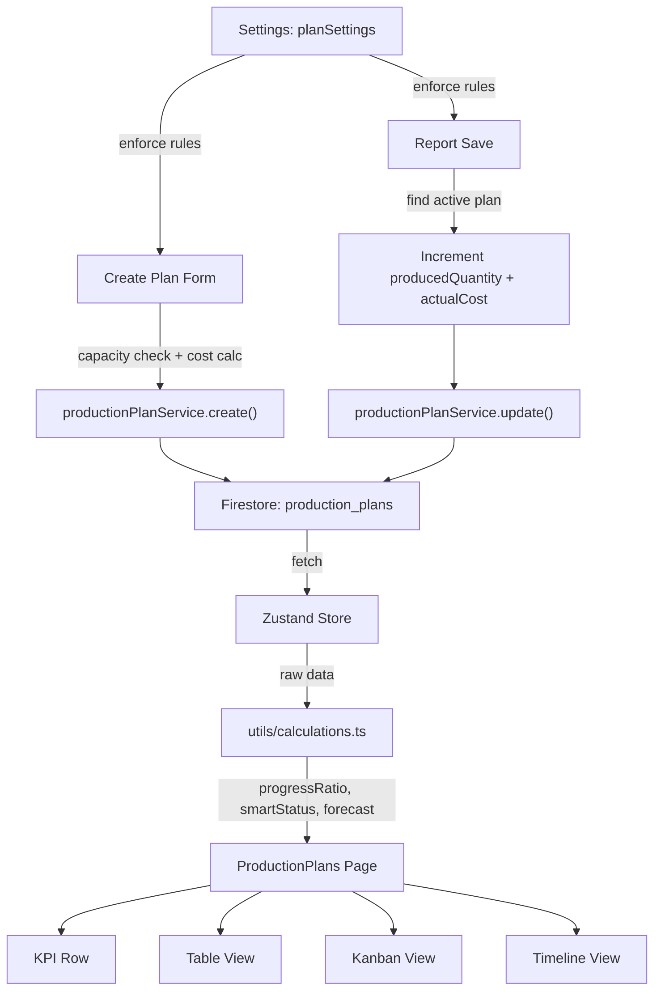

# Production Planning System Upgrade

## Current State

- **Data model** ([types.ts](types.ts) L134-143): `ProductionPlan` has `productId`, `lineId`, `plannedQuantity`, `startDate`, `status`, `createdBy`, `createdAt`
- **Page**: [pages/ProductionPlans.tsx](pages/ProductionPlans.tsx) (557 lines) - basic CRUD with table view, create form, edit/status/delete modals
- **Service**: [services/productionPlanService.ts](services/productionPlanService.ts) - Firestore CRUD + `getActiveByLine`
- **Store**: [store/useAppStore.ts](store/useAppStore.ts) - `productionPlans`, `planReports`, `createProductionPlan`, `updateProductionPlan`, `deleteProductionPlan`, `fetchProductionPlans`
- **Calculations**: [utils/calculations.ts](utils/calculations.ts) - `calculatePlanProgress`, `calculateDailyCapacity`, `calculateEstimatedDays`, `calculateAvgAssemblyTime`
- **Reports**: [pages/Reports.tsx](pages/Reports.tsx) - reports have no `planId` field; linkage is by `lineId + productId + date`
- **Settings**: [types.ts](types.ts) `SystemSettings` has `dashboardWidgets`, `alertSettings`, `kpiThresholds`, `printTemplate` -- no plan-related settings yet

## Architecture Approach

All computed values (progressRatio, timeRatio, forecastFinishDate, remainingDays, smartStatus) will remain **derived at runtime** in `utils/calculations.ts` -- never stored in Firestore. The new fields (`plannedEndDate`, `estimatedDurationDays`, etc.) stored in Firestore are **input/config fields** set at creation time. Settings like `allowMultipleActivePlans` go into `SystemSettings`.

---

## Step 1: Extend Data Model

**File**: [types.ts](types.ts)

Extend `ProductionPlan` interface with:

```typescript
export interface ProductionPlan {
  id?: string;
  productId: string;
  lineId: string;
  plannedQuantity: number;
  producedQuantity: number;       // NEW: incremented on report save
  startDate: string;
  plannedStartDate: string;       // NEW
  plannedEndDate: string;         // NEW
  estimatedDurationDays: number;  // NEW: auto-calculated at create time
  avgDailyTarget: number;         // NEW: plannedQuantity / estimatedDurationDays
  priority: 'low' | 'medium' | 'high' | 'urgent';  // NEW
  estimatedCost: number;          // NEW: auto-calculated
  actualCost: number;             // NEW: tracked from reports
  status: 'planned' | 'in_progress' | 'completed' | 'paused' | 'cancelled';
  createdBy: string;
  createdAt?: any;
}
```

Add `PlanPriority` type. Add `cancelled` status.

Extend `SystemSettings` with plan settings:

```typescript
export interface PlanSettings {
  allowMultipleActivePlans: boolean;
  allowReportWithoutPlan: boolean;
  allowOverProduction: boolean;
}

export interface SystemSettings {
  // ...existing fields...
  planSettings: PlanSettings;
}
```

---

## Step 2: Add Computed Logic

**File**: [utils/calculations.ts](utils/calculations.ts)

Add new pure functions -- all derived, never stored:

- `calculateProgressRatio(producedQuantity, plannedQuantity)` -- returns 0-100+ (can exceed 100 for over-production)
- `calculateTimeRatio(startDate, plannedEndDate)` -- elapsed days / total planned days
- `calculateForecastFinishDate(startDate, producedQuantity, plannedQuantity, avgDailyTarget)` -- projects completion date from daily rate
- `calculateRemainingDays(plannedEndDate)` -- days until planned end
- `calculateSmartStatus(progressRatio, timeRatio, status)` -- returns `on_track | at_risk | delayed | critical | completed`

These are called in the UI and in store selectors; they replace the simple `calculatePlanProgress` for the plans page.

---

## Step 3: Modify Reports Integration

**File**: [store/useAppStore.ts](store/useAppStore.ts) -- `createReport` action

On report save, after the existing logic:

1. Find the active plan for that `lineId + productId` combination
2. Increment `producedQuantity` on the plan by `quantityProduced`
3. Recalculate `actualCost` (labor cost for this report)
4. Recalculate plan status: if `producedQuantity >= plannedQuantity`, auto-set `status: 'completed'` (respecting `allowOverProduction` setting)
5. Call `productionPlanService.update(planId, updatedFields)`

**File**: [pages/Reports.tsx](pages/Reports.tsx)

- Add a read-only field showing the linked active plan (if any) for the selected `lineId + productId` -- display plan name/progress
- If `allowReportWithoutPlan` is `false` and no active plan exists for the line+product, show a warning and block submission

---

## Step 4: KPI Row on Production Plans Page

**File**: [pages/ProductionPlans.tsx](pages/ProductionPlans.tsx)

Add a KPI row above the plans table using the existing `KPIBox` component:

- **Active Plans** (count of `in_progress` + `planned`)
- **Delayed Plans** (count where `smartStatus === 'delayed' || 'critical'`)
- **Remaining Quantity** (sum of `plannedQuantity - producedQuantity` for active plans)
- **Avg Completion %** (average `progressRatio` across active plans)

---

## Step 5: Filters

**File**: [pages/ProductionPlans.tsx](pages/ProductionPlans.tsx)

Add a filter bar between the KPIs and table:

- **Status** multi-select (planned, in_progress, completed, paused, cancelled)
- **Line** select from `_rawLines`
- **Product** select from `_rawProducts`
- **Priority** select (low, medium, high, urgent)
- **Date range** (start date filter)

Apply filters with `useMemo` over `productionPlans` array. Use existing `SearchableSelect` for dropdowns.

---

## Step 6: View Modes (Table, Kanban, Timeline)

**File**: [pages/ProductionPlans.tsx](pages/ProductionPlans.tsx)

Add a view mode toggle (3 buttons with icons):

- **Table** (default) -- the existing table, enhanced with new columns (priority, end date, progress bar, smart status)
- **Kanban** -- group plans into columns by `status`. Each card shows product, line, progress bar, priority badge, dates. Drag-to-change-status is out of scope; clicking opens the status modal
- **Timeline** -- horizontal bar chart using simple CSS/div-based Gantt. Each plan is a bar from `plannedStartDate` to `plannedEndDate`, colored by smart status. Shows today marker line. Uses existing date helpers

All three modes render the same `filteredPlans` array.

---

## Step 7: Capacity Check

**File**: [pages/ProductionPlans.tsx](pages/ProductionPlans.tsx) -- inside `handleCreate`

Before saving a new plan:

1. Call `productionPlanService.getActiveByLine(formLineId)` (already exists)
2. Sum `avgDailyTarget` of all active plans on that line
3. Calculate the line's `dailyCapacity` (from `calculateDailyCapacity`)
4. If total load + new plan's target > capacity, show a warning modal with load details
5. User can dismiss and proceed or cancel

This is a client-side check only (no Firestore rule change needed).

---

## Step 8: Cost Integration

**File**: [pages/ProductionPlans.tsx](pages/ProductionPlans.tsx) -- create form

Auto-calculate `estimatedCost` at plan creation:

- `estimatedCost = estimatedDurationDays * avgDailyTarget * costPerUnit`
- `costPerUnit` from `laborSettings.hourlyRate * avgAssemblyTime / 60` + indirect cost allocation
- Use existing `buildProductAvgCost` from [utils/costCalculations.ts](utils/costCalculations.ts)
- Display in the live calculations section

`actualCost` is incremented on each report save (same as step 3).

The create form will auto-populate `estimatedCost` and store it. `actualCost` starts at 0.

---

## Step 9: Settings Controls

**File**: [pages/Settings.tsx](pages/Settings.tsx)

Add a new settings tab "Production Plans" (or section under existing tab) for admins:

- **allowMultipleActivePlans** (toggle) -- if false, creating a plan for a line that already has an active plan is blocked
- **allowReportWithoutPlan** (toggle) -- if false, report creation warns/blocks when no active plan exists
- **allowOverProduction** (toggle) -- if false, block report when `producedQuantity >= plannedQuantity`

Default values in [utils/dashboardConfig.ts](utils/dashboardConfig.ts):

```typescript
export const DEFAULT_PLAN_SETTINGS: PlanSettings = {
  allowMultipleActivePlans: true,
  allowReportWithoutPlan: true,
  allowOverProduction: true,
};
```

Store reads these in `createReport` and `createProductionPlan` to enforce business rules.

---

## Files Changed Summary

- [types.ts](types.ts) -- extend `ProductionPlan`, add `PlanSettings` to `SystemSettings`
- [utils/calculations.ts](utils/calculations.ts) -- add computed functions (progressRatio, timeRatio, forecastFinishDate, remainingDays, smartStatus)
- [utils/dashboardConfig.ts](utils/dashboardConfig.ts) -- add `DEFAULT_PLAN_SETTINGS`
- [services/productionPlanService.ts](services/productionPlanService.ts) -- add `incrementProduced` method
- [store/useAppStore.ts](store/useAppStore.ts) -- modify `createReport` to update plan; modify `createProductionPlan` for capacity/settings checks
- [pages/ProductionPlans.tsx](pages/ProductionPlans.tsx) -- major rewrite: KPIs, filters, view modes (table/kanban/timeline), capacity check, cost display, new form fields
- [pages/Reports.tsx](pages/Reports.tsx) -- show linked plan info, enforce `allowReportWithoutPlan`
- [pages/Settings.tsx](pages/Settings.tsx) -- add plan settings tab

## Data Flow




